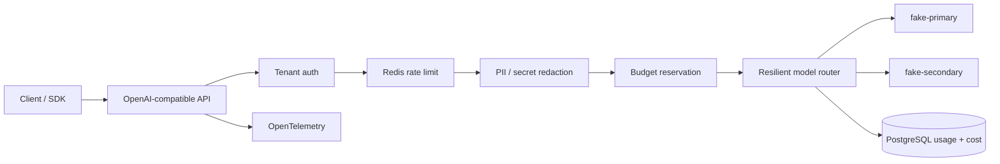

<p align="center">
  <strong>ModelRelay</strong><br/>
  Production-minded LLM gateway and AI reliability control plane
</p>

<p align="center">
  
  
  
  
  
  
</p>

ModelRelay is an OpenAI-compatible gateway that demonstrates the infrastructure around production AI traffic: provider abstraction, fallback, bounded retry, circuit breaking, tenant isolation, rate limiting, atomic cost-budget reservation, prompt redaction, normalized streaming, usage accounting and OpenTelemetry.

It intentionally runs with **deterministic fake model providers**. You can exercise outage and fallback behavior without an OpenAI/Anthropic/Google key and without sending a real prompt to an external service.

## Why this exists

Calling an LLM API is easy. Operating one safely across tenants is not.

ModelRelay focuses on the engineering problems around the model call:

| Concern | Implementation |
|---|---|
| Provider portability | `ILlmProvider` port keeps vendor schemas behind the gateway |
| Transient outage | Per-provider timeout + bounded retry + fallback |
| Repeated failure | In-memory circuit registry opens unhealthy providers |
| Tenant isolation | Hashed API key resolves tenant identity |
| Noisy tenant | Redis fixed-window request limiter |
| Cost control | Worst-case request cost reserved atomically before routing |
| Concurrent budget spend | PostgreSQL serializable transaction locks the tenant/month budget row |
| Crashed reservation | Reservations older than 15 minutes stop counting |
| Prompt privacy | Email / secret-like / long-number redaction before provider boundary; prompt bodies are not persisted |
| Streaming | OpenAI-style SSE chunks terminated by `[DONE]` |
| Auditability | Usage records contain routing/cost/token metadata, never the prompt body |
| Observability | OpenTelemetry traces + custom request/fallback/redaction/latency metrics |
| Local reproducibility | Docker Compose: API + PostgreSQL + Redis + OTLP collector |

## System shape



See [architecture.md](docs/architecture.md), [threat-model.md](docs/threat-model.md) and the [ADRs](docs/adr).

## Run locally

Prerequisite: Docker with Compose v2.

```bash
docker compose up --build
```

Then open the dashboard at:

- Control plane: <http://localhost:8080>
- Liveness: <http://localhost:8080/health/live>
- Readiness: <http://localhost:8080/health/ready>

The local sandbox API key is:

```text
relay_demo_key_change_me
```

It is not a real credential. Override it with `MODELRELAY_DEMO_API_KEY`.

## Make a completion

```bash
curl -i http://localhost:8080/v1/chat/completions \
  -H 'Content-Type: application/json' \
  -H 'X-Api-Key: relay_demo_key_change_me' \
  -d '{
    "model": "relay-fast",
    "messages": [
      { "role": "user", "content": "Explain idempotency in one paragraph." }
    ],
    "max_tokens": 128
  }'
```

Response headers expose the route taken:

```text
X-ModelRelay-Provider: fake-primary
X-ModelRelay-Fallbacks: 0
X-ModelRelay-Redactions: 0
```

## Demonstrate the hard paths

```bash
make demo
make fallback
make stream
```

To force the primary provider to fail, put `[fail-primary]` anywhere in the prompt. The router exhausts its bounded primary policy and falls back to `fake-secondary`.

```bash
curl -i http://localhost:8080/v1/chat/completions \
  -H 'Content-Type: application/json' \
  -H 'X-Api-Key: relay_demo_key_change_me' \
  -d '{
    "model": "relay-fast",
    "messages": [
      { "role": "user", "content": "[fail-primary] explain circuit breakers" }
    ]
  }'
```

Use `[fail-all]` to force a `503` and verify that the budget reservation is released. Use `[timeout]` to exercise timeout handling.

## Streaming

```bash
curl -N http://localhost:8080/v1/chat/completions \
  -H 'Content-Type: application/json' \
  -H 'X-Api-Key: relay_demo_key_change_me' \
  -d '{
    "model": "relay-balanced",
    "stream": true,
    "messages": [
      { "role": "user", "content": "Give me three API reliability rules." }
    ]
  }'
```

The sandbox providers return a deterministic completed result; the gateway then emits normalized OpenAI-style SSE chunks. A real provider adapter could stream natively behind the same client contract.

## Budget correctness

The interesting budget race is handled before provider execution.

1. Estimate prompt tokens and clamp `max_tokens`.
2. Calculate a worst-case cost using synthetic sandbox pricing.
3. Start a PostgreSQL `SERIALIZABLE` transaction.
4. Lock the tenant/month budget row.
5. Sum active reservations and reject the request if the cap would be exceeded.
6. Create a reservation.
7. On success, commit actual spend + usage and delete the reservation in one transaction.
8. On provider failure, delete the reservation.
9. A crashed reservation stops counting after 15 minutes.

This is intentionally stronger than a `SELECT SUM(cost)` check followed by a provider call.

> Pricing values in this repository are synthetic test values and are **not** current vendor prices.

## Privacy boundary

ModelRelay does not persist prompt or completion bodies in its usage table. The sample redactor replaces:

- email addresses
- secret/API-token-like strings
- 13–19 digit number sequences

before the provider boundary.

Regex redaction is not a complete DLP system. The threat model calls this out explicitly.

## Dashboard

The React control plane shows:

- requests and tokens in the last 24 hours
- monthly synthetic cost versus tenant budget
- p95 provider latency
- fallback count
- per-provider route count and average latency
- an interactive completion playground

The UI is built into the production container.

## Repository map

```text
.
├── src/
│   ├── ModelRelay.Api/             HTTP boundary, auth, telemetry
│   ├── ModelRelay.Core/            contracts, pricing, redaction, routing
│   └── ModelRelay.Infrastructure/  PostgreSQL, Redis, fake providers
├── tests/                          routing, pricing and redaction tests
├── ui/                             React + TypeScript control plane
├── db/migrations/                  idempotent SQL schema
├── docs/                           architecture, threat model, ADRs
├── observability/                  OTLP collector config
├── compose.yml
└── Dockerfile
```

## Build and test

Backend:

```bash
dotnet restore ModelRelay.slnx
dotnet build ModelRelay.slnx -c Release --no-restore
dotnet test ModelRelay.slnx -c Release --no-build
```

Dashboard:

```bash
cd ui
npm install
npm run build
```

CI runs both builds and then builds the production container. Dependabot tracks NuGet, npm, Actions and Docker dependencies.

## Current package baseline

This first version targets current stable package lines as of August 2026: .NET 10, Npgsql 10.0.3, StackExchange.Redis 3.1.x, OpenTelemetry .NET 1.17.x, React 19.2.x and Vite 8.2.x.

## Deliberate boundaries

- Fake providers are simulators; this repo does not claim to run a real hosted model.
- Circuit state is process-local. A multi-replica deployment would externalize/shared-health policy or accept replica-local circuits.
- The fixed-window limiter is intentionally simple.
- The sample redactor is narrow and should not be treated as comprehensive PII detection.
- Synthetic pricing proves cost-control mechanics without coupling the sample to frequently changing vendor price sheets.
- The API-key flow is suitable for a service-to-service sandbox. A full control plane would add issuance, rotation, revocation and audit workflows.

## License

MIT
