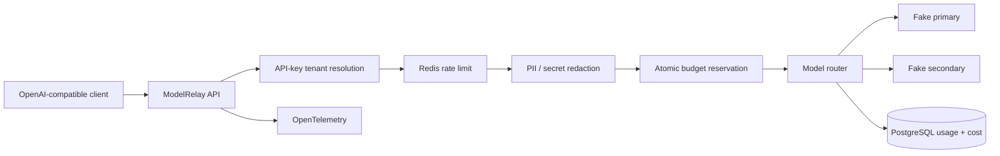

# Architecture

ModelRelay is a small AI gateway that demonstrates the reliability and governance work that sits between an application and model providers.

## Request boundary

A completion follows this order:

1. Resolve a tenant from the hash of `X-Api-Key`.
2. Consume a tenant/minute Redis counter.
3. Redact supported sensitive patterns from the in-memory prompt copy.
4. Estimate the worst-case token cost and create a PostgreSQL budget reservation in a serializable transaction.
5. Route through a bounded timeout/retry/circuit-breaker policy.
6. Calculate actual synthetic sandbox cost from the normalized provider result.
7. Commit usage and budget spend in one transaction, deleting the reservation.
8. Return an OpenAI-compatible response and routing headers.

Prompt bodies are never written to PostgreSQL.

## Failure semantics

| Failure | Behavior |
|---|---|
| Invalid API key | `401`, no provider call |
| Tenant rate exhausted | `429` + `Retry-After`, no provider call |
| Budget cannot be reserved | `402`, no provider call |
| Primary transient failure | bounded retry, then fallback |
| Circuit open | provider skipped |
| All providers unavailable | reservation released, `503` |
| Client requests streaming | normalized SSE chunks + `[DONE]` |
| Process dies after reservation | reservation stops counting after 15 minutes |

## Deliberate boundaries

This repository does not pretend that its fake providers are real LLMs. The design keeps the provider port explicit so a production adapter can be added without leaking vendor schemas into the client contract.

The regex redactor is demonstrative, not a complete DLP product. Synthetic pricing is intentionally independent of current vendor pricing.
